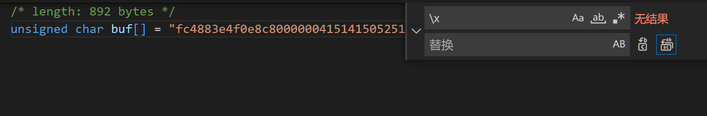
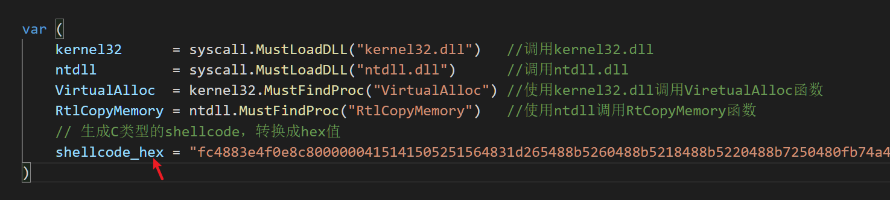
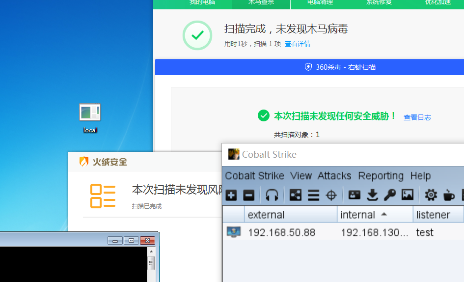
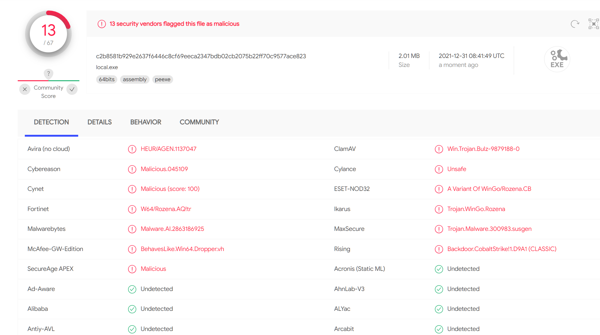

# shellcode go语言免杀

## 使用方法

1.将cs生成的C的shellcode转变成hex字符串，把`\x`全部替换成空字符即可

2.将字符串复制到变量`shellcode_hex`中

3.使用 `go build -o bypass.exe loader.go`即可在当前目录生成一个`bypass.exe`文件,运行有黑窗，使用`go build -o bypass.exe -ldflags -H=windowsgui loader.go`去黑窗会被360查杀，360这查杀就离谱。。。还是用来内网渗透的时候过edr后台运行靠谱。

## 免杀效果

1.国产三件套

2.在线查杀效果

